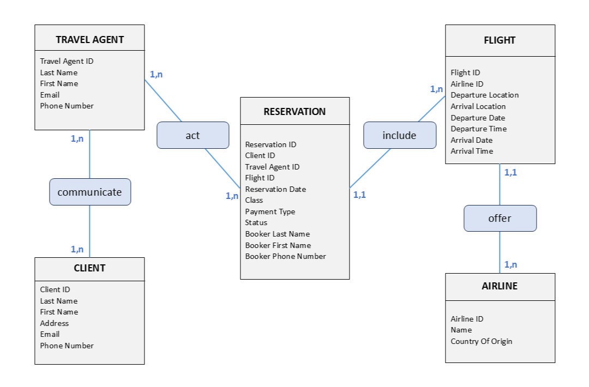

<h1 align="center">Data Management System for Travel Agency</h1> 

 
 


<p align="center">
  
</p>

This JavaFX application is designed as **a dedicated workspace for travel agency staff**.  
It allows them to easily manage client reservations while accessing pre-filled flight and airline information, which is updated by the administration.  

The application is based on a **MySQL database** and offers different levels of access:  
- **Travel consultants** manage clients and their reservations only.  
- **The administration** manages flights, airlines, and agency staff.  

---

## Download

You can download the stable, ready-to-use version here:

<p align="center">
  <a href="https://github.com/rmdair/Gestion_Reservations_JavaFX/releases/tag/v1.0.0">
    
  </a>
</p>


## Conceptual Data Model (CDM)

Here is the structure of the project's main entities:

<p align="center">
  
</p>

Bookings are the central element of the model.  
Each of them is associated with the client who makes the reservation, the travel consultant who manages it, and the corresponding flight.


## Features

Travel consultants can:  
- Add, modify, or cancel a client's reservation.  
- View available flights and operating airlines.  
- Access a consolidated view of reservations in Excel format.  
- Manage clients and track their travel history.  


## Project Structure

```plaintext
docker/                 → MySQL container configuration
├── docker-compose.yml  → Database deployment
├── initialization.sql  → Sample SQL initialization script for testing

src/                    → Project source code
├── config/             → MySQL connection management
│   ├── DatabaseConnection.java
│   ├── test.java
├── models/             → Entity definitions
│   ├── Client.java
│   ├── TravelAgent.java
│   ├── Airline.java
│   ├── Flight.java
│   ├── Reservation.java
├── dao/                → Data access (CRUD operations)
│   ├── ClientDAO.java
│   ├── TravelAgentDAO.java
│   ├── AirlineDAO.java
│   ├── FlightDAO.java
│   ├── ReservationDAO.java
├── fx/                 → JavaFX graphical interface
│   ├── ClientFX.java
│   ├── TravelAgentFX.java
│   ├── AirlineFX.java
│   ├── FlightFX.java
│   ├── ReservationFX.java
│   ├── ExcelViewFX.java
│   ├── Main.java       → Main application entry point
```


## Docker Commands

**Start the MySQL database**

```bash
docker-compose up -d
```

**Access MySQL inside the container** 
```bash
docker exec -it project_travel_agency mysql -u project_travel_agency -p      
```
or
```bash
docker exec -it project_travel_agency mysql -u root -p
```

**Stop and remove the container**  
```bash
docker-compose down
```


## Launching the JavaFX Interface

### Running from Eclipse  
**Eclipse IDE** is a powerful and widely used integrated development environment for Java programming.
The graphical interface can be launched directly from Eclipse, which is ideal to develop the application's code:  

1. **Create a new Java project in Eclipse**
    
2. **Add the existing `src/` directory to the project**  
   - Right-click on the newly created project in **Project Explorer**  
   - Select **Properties → Java Build Path → Source**  
   - Click **Add Folder...**, select the existing [`src/`](../src/) directory, and click **Apply and Close**  

3. **Add the required libraries**:  
   - Download **JavaFX SDK** from [the official website](https://openjfx.io/)  
   - Download the **MySQL connector** from [the official website](https://www.mysql.com/products/connector/)  
   - Add these libraries to the project via **Build Path → Configure Build Path → Add External JARs**  

4. **Select `Main.java` in the `fx` package**  

5. **Click Run** to launch the application  


### Running from the Terminal  
The application can also be executed outside the IDE using the following command:  
```bash
java -p "javafx-sdk-23.0.1/lib" --add-modules javafx.controls,javafx.base,javafx.fxml,javafx.graphics,javafx.media,javafx.web --add-opens=javafx.graphics/javafx.scene=ALL-UNNAMED --add-exports javafx.base/com.sun.javafx.event=ALL-UNNAMED -jar executable.jar
```


## Documentation
One detailed report about the project is available:

**English Version** : [Read the report in English](../docs/reservation-data-management-EN.pdf)  
**French Version** : [Lire le rapport en français](../docs/gestion-donnees-reservations-FR.pdf)  


## Application Overview

### Clients Tab
<p align="center">
  
</p>

### Reservations Tab
<p align="center">
  
</p>

### Flights Tab
<p align="center">
  
</p>

### Airlines Tab
<p align="center">
  
</p>

### Travel Consultants Tab
<p align="center">
  
</p>

### Excel Overview
<p align="center">
  
</p>


## Clone and Launch the project

```bash
git clone https://github.com/rmdair/Gestion_Reservations_JavaFX.git

cd Gestion_Reservations_JavaFX

# Run the application (ensure JavaFX SDK path is correct)
java -p "javafx-sdk-23.0.1/lib" --add-modules javafx.controls,javafx.base,javafx.fxml,javafx.graphics,javafx.media,javafx.web --add-opens=javafx.graphics/javafx.scene=ALL-UNNAMED --add-exports javafx.base/com.sun.javafx.event=ALL-UNNAMED -jar executable.jar
```
